# Human Knowledge Evolution: A Complete Library

> *"If I have seen further, it is by standing on the shoulders of giants."* — Isaac Newton

## Overview

This comprehensive library documents the complete evolution of human epistemology—from prehistoric proto-knowledge to modern AI-driven science. It traces 5,000+ years of intellectual history across civilizations, disciplines, methodologies, and conceptual frameworks.

**Total Documents**: 38 specialized research documents
**Word Count**: ~120,000 words
**Scope**: Prehistory to 2025 CE
**Focus**: Scientific, mathematical, logical, and philosophical knowledge with rigorous sourcing

---

## Navigation Map

```mermaid
graph TB
    START[Human Knowledge Evolution Library]

    START --> CHRONO[Chronological Periods]
    START --> REGIONAL[Regional Traditions]
    START --> DISCIPLINES[Disciplinary Evolution]
    START --> METHODS[Methodological Development]
    START --> THEMES[Cross-Cutting Themes]

    CHRONO --> C1[01. Proto-Knowledge & Ancient Civilizations<br/>Prehistory - 500 BCE]
    CHRONO --> C2[02. Axial Age & Classical Philosophy<br/>800 BCE - 500 CE]
    CHRONO --> C3[03. Islamic Golden Age & Medieval Synthesis<br/>500 - 1400 CE]
    CHRONO --> C4[04. Renaissance & Scientific Revolution<br/>1400 - 1700]
    CHRONO --> C5[05. Enlightenment & 19th Century Specialization<br/>1700 - 1900]
    CHRONO --> C6[06. 20th Century Fracturing & Synthesis<br/>1900 - 2000]
    CHRONO --> C7[07. 21st Century Integration & AI Emergence<br/>2000 - Present]

    REGIONAL --> R1[Greek Philosophical Foundations]
    REGIONAL --> R2[Indian Knowledge Traditions]
    REGIONAL --> R3[Chinese Knowledge Traditions]
    REGIONAL --> R4[Islamic Scientific Contributions]
    REGIONAL --> R5[Mesoamerican Knowledge Systems]

    DISCIPLINES --> D1[Mathematics Evolution]
    DISCIPLINES --> D2[Physics Paradigms]
    DISCIPLINES --> D3[Chemistry Evolution]
    DISCIPLINES --> D4[Biology Evolution]
    DISCIPLINES --> D5[Astronomy Evolution]
    DISCIPLINES --> D6[Computing & AI History]
    DISCIPLINES --> D7[Linguistics Evolution]
    DISCIPLINES --> D8[Neuroscience & Cognitive Science]
    DISCIPLINES --> D9[Engineering Evolution]
    DISCIPLINES --> D10[Statistics & Probability]
    DISCIPLINES --> D11[Measurement & Metrology]
    DISCIPLINES --> D12[Philosophy of Science]
    DISCIPLINES --> D13[Experimental Method]

    METHODS --> M1[Logic Evolution]
    METHODS --> M2[Observation to Experimentation]
    METHODS --> M3[Proof Methods]
    METHODS --> M4[Classification & Taxonomy]
    METHODS --> M5[Modeling & Simulation]

    THEMES --> T1[Information Theory Unification]
    THEMES --> T2[Unification Theme]
    THEMES --> T3[Reductionism vs Emergence]
    THEMES --> T4[Determinism to Probability]
    THEMES --> T5[Abstraction & Formalization]
    THEMES --> T6[Instrumentation & Technology]

    DISCIPLINES --> SPECIAL[Specialized Deep-Dives]
    SPECIAL --> S1[Giants of Knowledge: 50 Biographical Sketches]
    SPECIAL --> S2[Knowledge Institutions: From Academies to AI Labs]

    style START fill:#e1f5ff,stroke:#333,stroke-width:4px
    style CHRONO fill:#ffe1e1,stroke:#333,stroke-width:2px
    style REGIONAL fill:#e1ffe1,stroke:#333,stroke-width:2px
    style DISCIPLINES fill:#fff4e1,stroke:#333,stroke-width:2px
    style METHODS fill:#f4e1ff,stroke:#333,stroke-width:2px
    style THEMES fill:#ffe1f4,stroke:#333,stroke-width:2px
```

---

## I. Chronological Periods

These documents trace the evolution of human knowledge chronologically, identifying key tipping points where knowledge branches diverged into modern disciplines.

### [01. Proto-Knowledge & Ancient Civilizations](./chronological/01-proto-knowledge-ancient-civilizations.md)
**Period**: Prehistory - 500 BCE
**Civilizations**: Sumerian, Babylonian, Egyptian, Indus Valley, Vedic, Chinese, Pre-Socratic Greek
**Key Developments**:
- Cuneiform writing (3400 BCE) - first external memory system
- Babylonian base-60 mathematics and Plimpton 322 (1800 BCE)
- Egyptian empirical medicine (Edwin Smith Papyrus, 1600 BCE)
- Vedic Shulba Sutras geometric algorithms (800 BCE)
- Greek natural philosophy (Thales, Pythagoras, Democritus)

**Tipping Points**:
- Writing systems enable knowledge preservation
- Mathematics abstracts from practical arithmetic to algebra
- Astronomy separates from astrology
- Medicine diverges from magic
- Natural philosophy emerges from theology

---

### [02. Axial Age & Classical Philosophy](./chronological/AXIAL_AGE_CLASSICAL_PHILOSOPHY.md)
**Period**: 800 BCE - 500 CE
**Regions**: Greece, India, China, Persia, Hebrew
**Key Developments**:
- **Greek**: Aristotelian logic (Organon), Euclidean geometry, Archimedes' mathematics, Hellenistic schools
- **Indian**: Nyaya logic (pramanas), Vaisheshika atomism, Buddhist epistemology (Dignaga)
- **Chinese**: Confucian learning, Taoist naturalism, Mohist logic and experimentation

**Critical Systems**:
- Aristotle's 24 valid syllogistic forms
- Euclid's axiomatic method (5 postulates → 467 propositions)
- Nyaya's 4 pramanas (perception, inference, analogy, testimony)
- Buddhist tetralemma and logical analysis

**Impact**: Created the logical, mathematical, and epistemological frameworks that enabled scientific method.

---

### [03. Islamic Golden Age & Medieval Synthesis](./chronological/03-islamic-golden-age-medieval-synthesis.md)
**Period**: 500 - 1400 CE
**Centers**: Baghdad, Cairo, Córdoba, Toledo, Paris, Oxford
**Key Developments**:
- **House of Wisdom** translation movement (Greek → Arabic)
- **Al-Khwarizmi**: Birth of algebra (~820 CE)
- **Ibn al-Haytham**: Experimental optics and scientific method (1011-1021)
- **Al-Biruni**: Earth radius measurement (0.5% accuracy)
- **Universities**: Bologna (1088), Paris (1150), Oxford (1167)

**Tipping Points**:
- Algebra transforms from rhetorical to symbolic
- Experimental method replaces authority-based knowledge
- Translation networks preserve and synthesize Greek, Persian, Indian knowledge
- Institutional knowledge production (universities) emerges

---

### [04. Renaissance & Scientific Revolution](./chronological/Renaissance_Scientific_Revolution_1400-1700.md)
**Period**: 1400 - 1700
**Key Figures**: Copernicus, Galileo, Kepler, Newton, Descartes, Leibniz
**Key Developments**:
- Printing press (~1440) democratizes knowledge
- Heliocentric revolution (Copernicus 1543, Kepler's laws 1609-1619)
- Experimental physics (Galileo's inclined planes, telescopic astronomy)
- Newtonian synthesis (*Principia*, 1687): Universal laws, calculus
- Analytic geometry (Descartes, 1637)

**Decisive Break**:
- Mathematics becomes the language of nature
- Experimental method institutionalized (Royal Society 1660)
- Mechanistic universe replaces Aristotelian teleology
- Science separates from natural philosophy

---

### [05. Enlightenment & 19th Century Specialization](./chronological/enlightenment-19th-century-specialization.md)
**Period**: 1700 - 1900
**Trend**: Knowledge **fractures** into specialized disciplines
**Key Developments**:
- **Mathematics**: Non-Euclidean geometry (Riemann, Lobachevsky), set theory (Cantor), formal logic (Frege)
- **Physics**: Thermodynamics, electromagnetism (Maxwell 1865), statistical mechanics (Boltzmann)
- **Chemistry**: Atomic theory (Dalton 1803), periodic table (Mendeleev 1869)
- **Biology**: Evolution (Darwin 1859), cell theory, genetics (Mendel 1866)
- **Professionalization**: Journals, universities, specialized societies

**Tipping Points**:
- "Natural philosophy" becomes "physics" (terminology change 1830s-1870s)
- Maxwell's equations unify electricity, magnetism, light
- Darwin's mechanism makes evolution scientific
- Non-Euclidean geometry shatters Kant's a priori certainty

---

### [06. 20th Century Fracturing & Interdisciplinary Synthesis](./chronological/20th-century-fracturing-and-synthesis.md)
**Period**: 1900 - 2000
**Revolutions**: Quantum mechanics, relativity, DNA, computation, information theory
**Key Developments**:
- **Physics**: Quantum mechanics (1925-1927), general relativity (1915), Standard Model (1970s)
- **Mathematics**: Gödel's incompleteness (1931), Turing machines (1936), category theory
- **Biology**: DNA structure (1953), central dogma, molecular biology, genomics
- **Computing**: ENIAC (1945), programming languages, AI summers/winters
- **Unification**: Information theory (Shannon 1948) unifies physics, biology, computation

**Paradigm Shattering**:
- Quantum mechanics destroys determinism
- Gödel proves mathematics incomplete
- Turing defines limits of computation
- DNA makes biology molecular
- Shannon connects entropy to information

---

### [07. 21st Century Integration, Complexity Science & AI Emergence](./chronological/21st-century-ai-emergence.md)
**Period**: 2000 - Present
**Convergence**: AI, genomics, quantum computing, complexity science
**Key Developments**:
- **Deep learning revolution**: ImageNet (2012), AlphaGo (2016), transformers (2017)
- **Genomics**: Human Genome Project (2003), CRISPR (2012), AlphaFold (2020)
- **Quantum information**: Quantum computing, gravitational waves (LIGO 2015)
- **Complexity**: Network science, emergence, self-organization
- **Democratization**: ArXiv, Wikipedia, MOOCs, open source, AI assistants

**Epistemological Questions**:
- Is deep learning science or engineering?
- Can we understand neural networks or only use them?
- Does AI democratize expertise or concentrate power?
- What is the role of human understanding in machine prediction?

---

## II. Regional Knowledge Traditions

These documents explore how different civilizations developed distinct epistemological frameworks and contributed unique insights to global knowledge.

### [Greek Philosophical Foundations](./regional/greek-philosophical-foundations.md)
**Contributions**: Logic (Aristotle), axiomatic geometry (Euclid), atomism (Democritus), natural philosophy (Pre-Socratics), Platonic idealism
**Institutions**: Academy (387 BCE), Lyceum (335 BCE), Library of Alexandria (283 BCE)
**Legacy**: Western rationalism, deductive logic, mathematical proof, systematic philosophy

---

### [Indian Knowledge Traditions](./regional/indian-knowledge-traditions.md)
**Contributions**: Decimal system with zero, Panini's generative grammar (500 BCE), Nyaya logic, Buddhist epistemology, Kerala calculus (1400s), Ramanujan
**Disciplines**: Mathematics (Aryabhata, Brahmagupta), Ayurveda medicine, astronomical precision
**Modern**: Raman (Nobel 1930), Chandrasekhar (Nobel 1983), Bose-Einstein statistics

---

### [Chinese Knowledge Traditions](./regional/chinese-knowledge-traditions.md)
**Contributions**: I Ching binary system, decimal mathematics, printing, gunpowder, compass, paper, astronomical observations
**Epistemology**: Pattern recognition (li) vs. causal laws, harmony and balance, algorithmic mathematics
**Scholars**: Confucius, Laozi, Mozi, Shen Kuo, Zhu Xi
**Needham Question**: Why did scientific revolution occur in Europe despite Chinese technological lead?

---

### [Islamic Scientific Contributions](./regional/islamic-scientific-contributions.md)
**Golden Age**: 750-1258 CE
**Key Figures**: Al-Khwarizmi (algebra), Ibn al-Haytham (optics), Al-Biruni (universal scholar), Ibn Sina (medicine), Al-Tusi (astronomy)
**Institutions**: House of Wisdom (Baghdad), hospitals, observatories, libraries
**Legacy**: Preserved Greek knowledge, created algebra, pioneered experimental method, transmitted to medieval Europe

---

### [Mesoamerican Knowledge Systems](./regional/mesoamerican-knowledge.md)
**Contributions**: Base-20 mathematics, independent zero invention, Long Count calendar, astronomical precision (Venus cycle, eclipses)
**Achievements**: Calendar mathematics, agricultural innovations (milpa, chinampas), architectural engineering
**Mathematics**: Vigesimal system, calendar calculations, astronomical periods

---

## III. Disciplinary Evolution

These documents trace how modern scientific disciplines emerged from natural philosophy and developed into specialized fields.

### [Mathematics Evolution](./specialized/mathematics-evolution.md)
**Threads**: Number systems → Algebra → Geometry → Calculus → Logic → Abstract algebra → Computation
**Key Transitions**:
- Babylonian algorithms → Al-Khwarizmi's algebra → Vieta's symbolic notation
- Euclid's axioms → Non-Euclidean geometries → Riemann manifolds
- Newton/Leibniz calculus → Rigorous analysis → Category theory
- Aristotelian logic → Boole → Frege → Gödel → Turing

---

### [Physics Paradigms](./specialized/physics-paradigms.md)
**Paradigm Shifts**: 8 revolutionary transformations
1. Aristotelian Physics (350 BCE) → **Broken by**: Galileo's experiments
2. Newtonian Mechanics (1687) → **Broken by**: Mercury's perihelion, Michelson-Morley
3. Maxwell's Electromagnetism (1865) → **Broken by**: Blackbody radiation
4. Thermodynamics (1850-1900) → **Integrated with**: Statistical mechanics
5. Special Relativity (1905) → **Extended by**: General relativity
6. General Relativity (1915) → **Incompatible with**: Quantum mechanics
7. Quantum Mechanics (1925) → **Integrated into**: Quantum field theory
8. Quantum Field Theory (1950s-1970s) → **Unsolved**: Quantum gravity

---

### [Chemistry Evolution](./specialized/chemistry-evolution.md)
**Eras**: Alchemy → Phlogiston → Lavoisier's revolution → Atomic theory → Periodic table → Quantum chemistry → Computational design
**Breakthroughs**: Lavoisier's oxygen (1789), Dalton's atoms (1803), Mendeleev's table (1869), Pauling's bonding (1930s), AlphaFold (2020)

---

### [Biology Evolution](./specialized/biology-evolution.md)
**Stages**: Natural history → Anatomy → Microscopy → Cell theory → Evolution → Genetics → Molecular biology → Genomics → Synthetic biology
**Revolutions**: Darwin (1859), Mendel (1866), Watson-Crick (1953), Human Genome (2003), CRISPR (2012), AlphaFold (2020)

---

### [Astronomy Evolution](./specialized/astronomy-evolution.md)
**Progression**: Naked eye → Telescope → Spectroscopy → Photography → Radio → X-ray → Gravitational waves → Multi-messenger
**Milestones**: Hipparchus catalog (150 BCE), Galileo's moons (1610), Hubble expansion (1929), pulsars (1967), LIGO (2015), EHT black hole image (2019)

---

### [Computing & AI History](./specialized/computing-ai-history.md)
**Evolution**: Mechanical → Electrical → Electronic → Programmable → Networked → AI
**Eras**: Babbage (1837) → Turing (1936) → ENIAC (1945) → Internet (1969) → Deep learning (2012) → Transformers (2017) → LLMs (2022-2024)

---

### [Linguistics Evolution](./specialized/linguistics-evolution.md)
**Stages**: Panini (500 BCE) → Comparative philology (1786) → Saussure structuralism (1916) → Chomsky generative grammar (1957) → NLP → Transformers (2017)
**Debates**: Nativism vs empiricism, syntax vs semantics, symbolic vs statistical

---

### [Neuroscience & Cognitive Science](./specialized/neuroscience-cognitive-science.md)
**Progression**: Brain theories → Localization → Neuron doctrine → Action potentials → Cognitive revolution → Brain imaging → Connectomics
**Key**: Hodgkin-Huxley equations (1952), split-brain research (1960s), fMRI (1990s), computational neuroscience

---

### [Engineering Evolution](./specialized/engineering-evolution.md)
**Domains**: Civil → Mechanical → Electrical → Chemical → Aeronautical → Nuclear → Computer → Genetic → Quantum
**Span**: Pyramids (2600 BCE) → Steam engines (1700s) → Transistors (1947) → CRISPR (2012) → Quantum computers (2020s)

---

### [Statistics & Probability](./specialized/statistics-probability.md)
**Development**: Gambling → Pascal-Fermat (1654) → Bayes (1763) → Gauss (1809) → Fisher (1920s) → Shannon (1948) → ML (1990s-present)
**Applications**: Statistical mechanics, hypothesis testing, information theory, machine learning

---

### [Measurement & Metrology](./specialized/measurement-metrology.md)
**Evolution**: Body-based → Local standards → Metric system (1795) → SI units (1960) → Fundamental constants (2019)
**Precision**: Centimeters (ancient) → Micrometers → Nanometers → Atomic-scale (10^-18 m for LIGO)

---

### [Philosophy of Science](./specialized/philosophy-of-science.md)
**Traditions**: Ancient epistemology → Medieval natural philosophy → Baconian induction → Logical positivism → Popper's falsificationism → Kuhn's paradigms → Contemporary pluralism
**Questions**: What is scientific knowledge? How do we justify scientific claims? What is the structure of scientific revolutions?

---

### [Experimental Method](./specialized/experimental-method.md)
**Stages**: Observation → Systematic collection → Controlled intervention → Statistical design → RCTs → Computational experiments
**Case Studies**: Lind's scurvy trial (1747), Pasteur's anthrax (1881), Michelson-Morley (1887), LIGO (2015)

---

## IV. Methodological Development

These documents analyze how fundamental methods of knowledge production evolved across disciplines.

### [Logic Evolution](./methodological/logic-evolution.md)
**Progression**: Aristotelian syllogisms → Stoic propositional logic → Medieval logic → Boole's algebra → Frege's predicate calculus → Gödel → Turing → Automated theorem proving
**Modern**: Modal logic, fuzzy logic, paraconsistent logic, proof assistants (Coq, Lean)

---

### [Observation to Experimentation](./methodological/observation-to-experimentation.md)
**Stages**:
1. Passive observation (Hippocrates)
2. Systematic collection (Tycho Brahe)
3. Controlled intervention (Galileo, Newton)
4. Statistical design (Pasteur, Fisher)
5. Double-blind RCTs (1948)
6. Computational experiments (2000s)

---

### [Proof Methods](./methodological/proof-methods.md)
**Types**: Geometric proof (Euclid) → Contradiction → Induction → Constructive vs non-constructive → Probabilistic → Computer-assisted → Automated theorem proving
**Tools**: Proof assistants (Coq, Lean), formalization projects

---

### [Classification & Taxonomy](./methodological/classification-taxonomy.md)
**Systems**: Aristotelian categories → Linnaean taxonomy → Periodic table → Stellar classification → Particle physics → Library systems → AI ontologies → Knowledge graphs
**Principles**: Hierarchy vs network, natural vs artificial kinds

---

### [Modeling & Simulation](./methodological/modeling-simulation.md)
**Evolution**: Physical models → Mathematical equations → Analog computers → Numerical simulation → Monte Carlo → Finite elements → Agent-based → Neural networks → Digital twins
**Validation**: How do we know models are accurate?

---

## V. Cross-Cutting Themes

These documents analyze fundamental conceptual themes that cut across disciplines and historical periods.

### [Information Theory Unification](./specialized/information-theory-unification.md)
**Thesis**: Shannon's information theory (1948) provides universal language unifying physics (entropy), biology (genetic code), cognition (neural coding), and machine learning
**Equations**: Shannon entropy, Landauer's principle, Bekenstein bound, mutual information
**Applications**: Black holes, DNA, neural spikes, deep learning

---

### [Unification Theme](./themes/unification-theme.md)
**Successes**: Newton (celestial+terrestrial), Maxwell (E+M+light), Thermodynamics+statistical mechanics, Electroweak, Standard Model
**Failures**: Grand Unified Theories (no proton decay), String theory (landscape problem)
**Quest**: General relativity + quantum mechanics = Theory of everything?

---

### [Reductionism vs Emergence](./themes/reductionism-emergence.md)
**Positions**: Democritus atomism → Cartesian mechanism → 19th century reductionism → Complexity science emergence
**Examples**: Phase transitions, life from chemistry, consciousness from neurons, social from individual
**Resolution**: Explanatory pluralism—ontological physicalism with explanatory anti-reductionism

---

### [Determinism to Probability](./themes/determinism-probability.md)
**Evolution**: Laplacian determinism → Statistical mechanics → Quantum indeterminacy → Chaos theory → Probabilistic ML
**Implications**: Free will, predictability limits, knowledge under uncertainty
**Equations**: Schrödinger equation, Heisenberg uncertainty, Lorenz system, Bayes' theorem

---

### [Abstraction & Formalization](./themes/abstraction-formalization.md)
**Progression**: Concrete counting → Abstract numbers → Symbolic algebra → Set theory → Formal systems → Gödel's limits
**Power**: Category theory, Langlands program, Noether's theorem, type theory
**Limits**: Incompleteness, undecidability, interpretation challenges

---

### [Instrumentation & Technology](./themes/instrumentation-technology.md)
**Progression**: Naked eye → Telescope/microscope → Spectroscope → Photography → Particle detectors → Electron microscopy → fMRI → LIGO → AI pattern recognition
**Impact**: Each instrument opens new phenomenological domains
**Philosophy**: Extended cognition, instrument-relative reality

---

## VI. Specialized Deep-Dives

### [Giants of Knowledge: 50 Biographical Sketches](./specialized/giants-of-knowledge.md)
**Coverage**: 50 pivotal figures from Thales (624 BCE) to Chomsky (1928-)
**Diversity**: Greek, Indian, Islamic, Chinese, European, women scientists
**Format**: Birth/death dates, key breakthroughs, paradigm shifts, primary publications, legacy, quotes

---

### [Knowledge Institutions](./specialized/knowledge-institutions.md)
**Evolution**: Ancient academies → Islamic madrasas → Medieval universities → Scientific societies → Research universities → Big science → Corporate AI labs
**Analysis**: Governance, funding, validation, incentives, access
**Institutions**: Library of Alexandria, House of Wisdom, Bologna, Royal Society, Humboldt model, CERN, DeepMind

---

## How to Use This Library

### By Interest Area

**Want comprehensive chronological narrative?**
→ Read chronological documents 01-07 in sequence

**Interested in a specific discipline?**
→ Jump to disciplinary evolution (mathematics, physics, biology, etc.)

**Curious about cross-cultural perspectives?**
→ Explore regional traditions (Greek, Indian, Chinese, Islamic, Mesoamerican)

**Studying philosophy of science?**
→ Start with methodological and thematic documents

**Looking for biographical information?**
→ See "Giants of Knowledge" for 50 detailed sketches

### By Question

**How did mathematics become abstract?**
→ Mathematics Evolution + Abstraction & Formalization theme

**When did experiments replace observation?**
→ Experimental Method + Observation to Experimentation

**Why did science develop in Europe?**
→ Scientific Revolution + Islamic Golden Age + Chinese/Indian traditions

**How did determinism give way to probability?**
→ Determinism to Probability + Physics Paradigms + Statistics & Probability

**What unified disparate fields?**
→ Information Theory Unification + Unification Theme + Physics Paradigms

**How do we know what we know?**
→ Philosophy of Science + Logic Evolution + Proof Methods

---

## Document Statistics

| Category | Documents | Total Words |
|----------|-----------|-------------|
| Chronological | 7 | ~30,000 |
| Regional Traditions | 5 | ~15,000 |
| Disciplinary Evolution | 13 | ~45,000 |
| Methodological | 5 | ~14,000 |
| Thematic | 6 | ~18,000 |
| **Total** | **38** | **~122,000** |

---

## Key Themes Across Documents

### 1. **Cumulative Progress**
Knowledge builds on previous knowledge. Newton's "shoulders of giants" is literal—each generation inherits and extends prior achievements.

### 2. **Paradigm Shifts**
Kuhn was right: Science advances through revolutions, not just accumulation. Quantum mechanics, relativity, DNA, Gödel, and AI are paradigm-shattering.

### 3. **Cross-Cultural Synthesis**
Modern science synthesizes Greek logic, Indian mathematics, Islamic experimentation, Chinese empiricism. No single tradition has a monopoly.

### 4. **Abstraction Enables Power**
Mathematics, logic, information theory—abstract frameworks provide computational and predictive power impossible with concrete thinking alone.

### 5. **Instrumentation Expands Reality**
Telescopes, microscopes, particle accelerators, fMRI, LIGO—each technology reveals previously inaccessible domains.

### 6. **Limits of Knowledge**
Gödel, Heisenberg, Turing, chaos theory—we've discovered fundamental limits to what can be known or computed.

### 7. **Democratization**
From oral tradition → writing → printing → internet → AI. Each technology democratizes knowledge access but raises new questions about quality and truth.

### 8. **Unfinished Quest**
Quantum gravity, consciousness, dark matter, P vs NP, AGI—the frontiers remain vast. Each answer reveals deeper questions.

---

## Citation and Attribution

All documents include:
- Primary source citations
- Modern scholarly references
- Historical dates and biographical details
- Mathematical equations and formulas
- Experimental procedures and specifications

This library is designed for:
- Students and researchers
- Historians of science
- Philosophers of knowledge
- Anyone curious about how humans came to understand reality

---

## Contributing and Feedback

This library represents a comprehensive synthesis of human epistemological evolution. Each document is extensively researched with academic rigor.

For the Codio CDN project context, see: `/docs/pm/TECHNICAL-PROPOSAL-PHASE-1.md`

---

## License

Part of the Codio CDN project documentation.
Repository: https://github.com/Iamcodio/codio-cdn

---

**Last Updated**: November 19, 2025
**Document Count**: 38
**Maintained by**: AI Research Collective (Claude + specialized research agents)

*Standing on the shoulders of giants, reaching toward the stars.*

---

